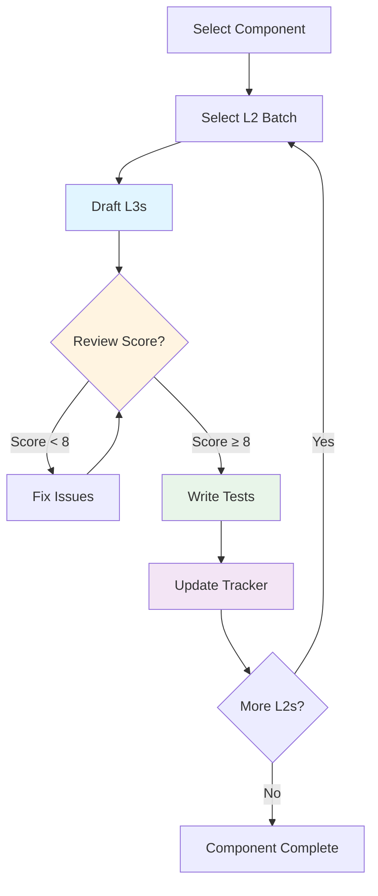
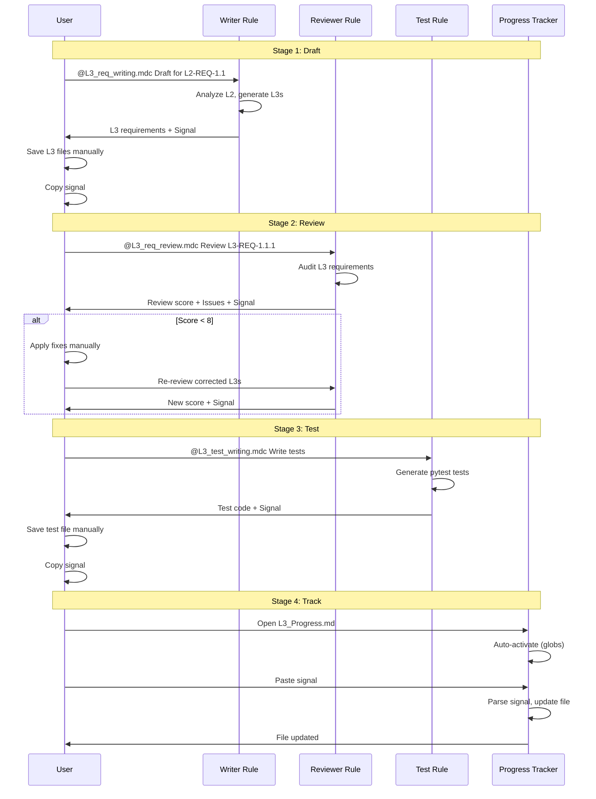

# L3 Production Pipeline and Progress Tracking

## Introduction

The L3 Production Pipeline is a systematic workflow for decomposing L2 requirements into L3 functional specifications. This document explains how to use the pipeline and the progress tracking system to manage the decomposition of 22 P0 L2 requirements across 5 components.

### Why Track Progress?

- **Visibility:** See at a glance which L2s are done, in progress, or blocked
- **Quality Control:** Track review scores and blockers to ensure quality
- **Planning:** Identify which components need attention
- **Prevent Duplication:** Know what's already been worked on

### Overview

The pipeline follows a **component-based, batch-processing approach** to prevent context interference when handling 100+ L3 requirements:

1. **Component Partitioning:** Process one component at a time (Graph Store, The Governor, etc.)
2. **Batch Processing:** Work in small batches of 3-7 L2 requirements per session
3. **Signal-Based Tracking:** Use explicit signals to update progress automatically
4. **Quality Gates:** Review score ≥ 8/10 required before proceeding to tests

---

## Component-Wise Development Strategy

### Development Order (Dependency-Based)

Components must be developed in **dependency order** to ensure that foundational components define ICDs and interfaces that dependent components can reference. This prevents circular dependencies and ensures proper interface contracts.

```mermaid
graph TD
    A[1. Graph Store] --> B[2. The Governor]
    A --> C[3. Vector Store]
    A --> D[6. Context Serializer]
    B --> E[4. LLM Orchestrator]
    C --> E
    E --> F[5. Streamlit Chat]
    B --> F
    C --> F
    D --> F
    
    style A fill:#263238
    style B fill:#37474f
    style C fill:#1a237e
    style D fill:#311b92
    style E fill:#b71c1c
    style F fill:#212121
```



### Component Development Sequence

#### 1. Graph Store (Foundation - No Dependencies)
**Why First:** All other components depend on Graph Store for data persistence and graph operations. This component defines the core data model and storage interfaces.

**L2 Requirements (7 total):**
- L2-REQ-1.1: Immutable Node Identity
- L2-REQ-1.2: Typed Node Schema
- L2-REQ-1.3: Typed Directed Edges
- L2-REQ-1.4: Graph Storage Model
- L2-REQ-1.6: Graph Query API
- L2-REQ-4.3: Constraint-Requirement Relationship

**Key Deliverables:**
- Graph data model (nodes, edges)
- Graph query API interfaces
- Storage schema definitions
- ICD-01: Graph Ontology (ICD-01)

**Dependent Components:** All (2-6)

---

#### 2. The Governor (Depends on Graph Store)
**Why Second:** The Governor enforces business rules and state management on top of Graph Store. It needs Graph Store interfaces to be defined first.

**Sub-Modules:**
- **State Machine module** (5 L2s - P0)
- **Constraint Rules module** (4 L2s - P0)
- **Permission Logic module** (3 L2s - P1, not in MVP scope)

**L2 Requirements (9 total P0):**

**State Machine module (5 L2s):**
- L2-REQ-2.1: Requirement State Machine
- L2-REQ-2.2: CRUD Operations
- L2-REQ-2.3: Stale Detection Mechanism
- L2-REQ-2.4: Approval Gate Enforcement
- L2-REQ-6.4: Quality Gate Blocking

**Constraint Rules module (4 L2s):**
- L2-REQ-7.1: Constraint Evaluation Engine
- L2-REQ-7.2: Conflict Blocking Mechanism
- L2-REQ-7.3: Dependency Conflict Detection
- L2-REQ-7.4: Real-Time Validation

**Key Deliverables:**
- State machine logic interfaces
- Constraint evaluation interfaces
- ICD-02: Governor APIs (if defined)

**Dependent Components:** LLM Orchestrator (4)

---

#### 3. Vector Store (Depends on Graph Store)
**Why Third:** Vector Store provides semantic search capabilities. It depends on Graph Store for data access but can be developed in parallel with The Governor.

**L2 Requirements:**
- Note: Vector Store functionality is allocated to LLM Orchestrator in MVP (L2-REQ-8.1, 8.2, 8.3, 8.4 are part of LLM Orchestrator). No separate Vector Store P0 L2s in MVP scope.

**Key Deliverables:**
- Embedding generation interfaces (via LLM Orchestrator)
- Semantic search APIs (via LLM Orchestrator)
- Vector storage schema (if separate component in future)

**Dependent Components:** LLM Orchestrator (4) - Vector Store is integrated into LLM Orchestrator in MVP

---

#### 4. LLM Orchestrator (Depends on Graph Store + Vector Store)
**Why Fourth:** LLM Orchestrator coordinates between Graph Store, Vector Store, and The Governor. It needs all three to be defined first.

**L2 Requirements (8 total):**
- L2-REQ-5.2: Draft Requirement Creation
- L2-REQ-6.1: Ambiguity Detection Engine
- L2-REQ-6.2: Verifiability Check
- L2-REQ-6.3: Real-Time Guidance Interface
- L2-REQ-8.1: Semantic Matching Engine
- L2-REQ-8.2: Automatic Edge Creation
- L2-REQ-8.3: Relationship Confidence Scoring
- L2-REQ-8.4: Background Inference Process

**Key Deliverables:**
- LLM orchestration interfaces
- Coach Mode APIs (drafting, guidance)
- Spider Mode APIs (inference, matching)
- ICD-03: LLM Orchestrator APIs (if defined)

**Dependent Components:** Streamlit Chat (5)

---

#### 5. Streamlit Chat (Depends on All Above)
**Why Fifth:** Streamlit Chat is the UI layer that depends on all backend components. It must be developed last to use all defined interfaces.

**L2 Requirements:**
- Note: Streamlit Chat L2s are split with LLM Orchestrator in MVP. L2-REQ-6.3 (Real-Time Guidance Interface) is shared between LLM Orchestrator (computation) and Streamlit Chat (display). No standalone Streamlit Chat P0 L2s in MVP scope.

**Key Deliverables:**
- UI component interfaces (if separate component in future)
- Chat interface APIs (if separate component in future)
- Real-time update mechanisms (via LLM Orchestrator integration)

**Dependent Components:** None (top-level UI, but integrated with LLM Orchestrator in MVP)

---

#### 6. Context Serializer (Depends on Graph Store)
**Why Sixth:** Context Serializer can be developed in parallel with other components but depends on Graph Store. It's listed last because it's a utility component.

**L2 Requirements (1 total):**
- L2-REQ-1.7: Graph-to-Text Serialization

**Key Deliverables:**
- Serialization interfaces
- Markdown/SysML v2 output formats
- ICD-04: Serializer APIs (if defined)

**Dependent Components:** LLM Orchestrator (uses serializer for context)

---

### Development Strategy

#### Phase 1: Foundation (Week 1-2)
**Focus:** Graph Store component
- Complete all 7 L2 requirements
- Define all Graph Store interfaces
- Establish ICD-01: Graph Ontology
- **Goal:** All Graph Store L3s drafted, reviewed, and tested**

#### Phase 2: Business Logic (Week 3-4)
**Focus:** The Governor component
- Complete State Machine module (5 L2s)
- Complete Constraint Rules module (4 L2s)
- Define Governor interfaces
- **Goal:** All 9 Governor L3s drafted, reviewed, and tested

#### Phase 3: Intelligence Layer (Week 5-6)
**Focus:** Vector Store + LLM Orchestrator
- Complete Vector Store L2s (if any P0)
- Complete LLM Orchestrator (8 L2s)
- Define LLM interfaces
- **Goal:** All LLM/Vector L3s drafted, reviewed, and tested

#### Phase 4: User Interface (Week 7)
**Focus:** Streamlit Chat + Context Serializer
- Complete Streamlit Chat L2s
- Complete Context Serializer (1 L2)
- Define UI interfaces
- **Goal:** All UI/Serializer L3s drafted, reviewed, and tested

### Why This Order Matters

1. **Interface Contracts:** Earlier components define ICDs that later components reference
2. **Dependency Resolution:** No circular dependencies - clear dependency chain
3. **Testing:** Can test components in isolation as they're completed
4. **Integration:** Later components integrate with already-tested components
5. **Context Scoping:** Working on one component at a time prevents context interference

### Component Completion Checklist

Before moving to the next component, verify:

- [ ] All L2s for current component are P0 priority
- [ ] All L3s drafted and saved to component folder
- [ ] All L3s reviewed with score ≥ 8/10
- [ ] All tests written and passing
- [ ] All signals provided to tracker
- [ ] Component marked "Complete" in `L3_Progress.md`
- [ ] ICD interfaces documented (if applicable)
- [ ] Cross-batch validation passed (ICD consistency, edge validation)

---

## The Production Pipeline

### Workflow Overview



### Pipeline Stages

#### Stage 1: Draft (Writer)
- **Tool:** `@L3_req_writing.mdc`
- **Input:** L2 requirements (P0 only)
- **Output:** L3 functional specifications
- **Signal:** `L3s drafted for [L2-IDs], count: [N]`

#### Stage 2: Review (Governor)
- **Tool:** `@L3_req_review.mdc`
- **Input:** Drafted L3 requirements
- **Output:** Review score (0-10), issues, corrected draft (if needed)
- **Signal:** `L3s reviewed: [L3-IDs], scores: [X]/10, blockers: [list]`

#### Stage 3: Fix (Iteration)
- **Action:** Apply corrections from reviewer
- **Repeat:** Re-review until score ≥ 8/10

#### Stage 4: Test (Test Engineer)
- **Tool:** `@L3_test_writing.mdc`
- **Input:** Reviewed L3 requirements (score ≥ 8)
- **Output:** Executable pytest tests
- **Signal:** `Tests written for [L3-IDs]`

#### Stage 5: Track (Progress Tracker)
- **Tool:** `@L3_progress_tracker.mdc`
- **Input:** Completion signals from above stages
- **Output:** Updated `L3_Progress.md`

---

## Orchestration and Execution

### Manual vs Automated Steps

Understanding what you do manually versus what happens automatically is crucial for efficient execution.

| Step | Manual | Automated | How It Works |
|------|--------|-----------|--------------|
| **Select Component & Batch** | ✅ You decide | ❌ | You review `L3_Progress.md` and choose which L2s to work on |
| **Activate Writer Rule** | ✅ You invoke | ❌ | You type `@L3_req_writing.mdc` in Cursor chat |
| **Generate L3 Requirements** | ❌ | ✅ Rule generates | Writer rule analyzes L2s and creates L3 specs |
| **Generate Draft Signal** | ❌ | ✅ Rule outputs | Writer rule automatically outputs signal at end |
| **Save L3 Files** | ✅ You save | ❌ | You manually save L3 files to component folder |
| **Activate Reviewer Rule** | ✅ You invoke | ❌ | You type `@L3_req_review.mdc` in Cursor chat |
| **Review L3 Requirements** | ❌ | ✅ Rule reviews | Reviewer rule performs comprehensive audit |
| **Generate Review Signal** | ❌ | ✅ Rule outputs | Reviewer rule automatically outputs signal with scores |
| **Apply Fixes** | ✅ You edit | ❌ | You manually edit L3 files based on reviewer feedback |
| **Activate Test Writer Rule** | ✅ You invoke | ❌ | You type `@L3_test_writing.mdc` in Cursor chat |
| **Generate Test Code** | ❌ | ✅ Rule generates | Test writer rule creates pytest test functions |
| **Generate Test Signal** | ❌ | ✅ Rule outputs | Test writer rule automatically outputs signal |
| **Open Progress Tracker** | ✅ You open file | ❌ | You open `L3_Progress.md` in Cursor |
| **Tracker Rule Activation** | ❌ | ✅ Auto-activates | Tracker rule activates via globs when file is opened |
| **Provide Signal to Tracker** | ✅ You paste | ❌ | You paste signal from writer/reviewer/test rule |
| **Update Progress Tracker** | ❌ | ✅ Rule updates | Tracker rule parses signal and updates file |

### Execution Guide

#### Stage 1: Draft - Manual Execution

**What You Do:**
1. Open Cursor chat (Composer or Chat)
2. Type the command:
   ```
   @L3_req_writing.mdc Draft L3 requirements for L2-REQ-1.1, L2-REQ-1.2, L2-REQ-1.3
   ```
3. Wait for rule to generate L3 requirements
4. **Copy the draft signal** from rule output (look for "L3s drafted for...")
5. Save L3 files manually:
   - Create folder if needed: `/requirements/L3/Graph-Store/`
   - Save each L3 as: `L3-REQ-1.1.1.md`, `L3-REQ-1.1.2.md`, etc.

**What Happens Automatically:**
- Writer rule analyzes L2 requirements
- Writer rule references Allocation Map, ICD, Architecture artifacts
- Writer rule generates L3 requirements with proper EARS patterns
- Writer rule outputs completion signal at the end

**Example Command:**
```
User: @L3_req_writing.mdc Draft L3 requirements for L2-REQ-1.1, L2-REQ-1.2

[Rule processes and generates L3s...]

Rule Output:
- L3-REQ-1.1.1: The Graph Store shall...
- L3-REQ-1.1.2: When [trigger], the Graph Store shall...
- L3-REQ-1.2.1: The Graph Store shall...

Signal: L3s drafted for L2-REQ-1.1, L2-REQ-1.2, count: 3
```

#### Stage 2: Review - Manual Execution

**What You Do:**
1. Open Cursor chat
2. Type the command:
   ```
   @L3_req_review.mdc Review these L3 requirements: L3-REQ-1.1.1, L3-REQ-1.1.2, L3-REQ-1.2.1
   ```
3. Review the audit results and score
4. **If score < 8/10:**
   - Apply corrections from "Corrected Draft" section
   - Re-run reviewer: `@L3_req_review.mdc Re-review these corrected L3 requirements: [L3-IDs]`
   - Repeat until score ≥ 8/10
5. **Copy the review signal** from rule output (look for "L3s reviewed...")

**What Happens Automatically:**
- Reviewer rule performs comprehensive audit (10 criteria)
- Reviewer rule calculates review score (0-10)
- Reviewer rule identifies issues with severity levels
- Reviewer rule generates corrected draft if score < 8
- Reviewer rule outputs completion signal with scores and blockers

**Example Command:**
```
User: @L3_req_review.mdc Review these L3 requirements: L3-REQ-1.1.1, L3-REQ-1.1.2

[Rule reviews and audits...]

Rule Output:
### Review Score: 8.5/10
### Audit Results Table
[Detailed audit results...]
### Issues Found
- Minor: Missing scenario reference in L3-REQ-1.1.2

Signal: L3s reviewed: L3-REQ-1.1.1, L3-REQ-1.1.2, scores: 8.5/10, blockers: None
```

#### Stage 3: Fix - Manual Execution (If Needed)

**What You Do:**
1. Open the L3 file that needs fixing (e.g., `L3-REQ-1.1.2.md`)
2. Apply corrections from reviewer's "Corrected Draft" section
3. Save the file
4. Re-run reviewer to verify fixes:
   ```
   @L3_req_review.mdc Re-review these corrected L3 requirements: L3-REQ-1.1.2
   ```
5. Continue until score ≥ 8/10

**What Happens Automatically:**
- Nothing - this is fully manual

#### Stage 4: Test - Manual Execution

**What You Do:**
1. Open Cursor chat
2. Type the command:
   ```
   @L3_test_writing.mdc Write tests for L3-REQ-1.1.1, L3-REQ-1.1.2, L3-REQ-1.2.1
   ```
3. Review generated test code
4. Save test file: `/tests/functional/test_l3_graph_store.py`
5. **Copy the test signal** from rule output (look for "Tests written...")

**What Happens Automatically:**
- Test writer rule analyzes L3 requirements
- Test writer rule generates pytest test functions
- Test writer rule creates proper markers and docstrings
- Test writer rule outputs completion signal

**Example Command:**
```
User: @L3_test_writing.mdc Write tests for L3-REQ-1.1.1, L3-REQ-1.1.2

[Rule generates test code...]

Rule Output:
```python
@pytest.mark.L3_REQ_1_1_1
@pytest.mark.functional
def test_uid_format_assignment():
    """Requirement: L3-REQ-1.1.1..."""
    # Test code...
```

Signal: Tests written for L3-REQ-1.1.1, L3-REQ-1.1.2
```

#### Stage 5: Track - Manual Execution

**What You Do:**
1. Open `requirements/L3_Progress.md` in Cursor
2. The tracker rule **automatically activates** (via globs)
3. Paste the signal you copied from previous stage:
   ```
   Update tracker - L3s drafted for L2-REQ-1.1, L2-REQ-1.2, count: 3
   ```
4. Verify the tracker updated correctly

**What Happens Automatically:**
- Tracker rule activates when `L3_Progress.md` is opened
- Tracker rule parses the signal
- Tracker rule finds matching L2 rows
- Tracker rule updates status, scores, blockers
- Tracker rule saves the file

**Example Command:**
```
User: [Opens L3_Progress.md]
[Tracker rule auto-activates]

User: Update tracker - L3s drafted for L2-REQ-1.1, L2-REQ-1.2, count: 3

Tracker: [Updates file automatically]
- Status: Pending → Drafted
- L3 Count: - → 3
```

### Orchestration Flow



### Quick Start Guide

**5-Step Execution:**

1. **Select Component & Batch:** Open `L3_Progress.md`, choose component (start with Graph Store), select 3-7 L2s
2. **Draft:** `@L3_req_writing.mdc Draft L3 requirements for [L2-IDs]` → Copy signal, save files
3. **Review:** `@L3_req_review.mdc Review these L3 requirements: [L3-IDs]` → If score < 8, fix and re-review → Copy signal
4. **Test:** `@L3_test_writing.mdc Write tests for [L3-IDs]` → Save test file, copy signal
5. **Track:** Open `L3_Progress.md`, paste all 3 signals: `Update tracker - [signal]`

---

## Using the Progress Tracker

### L3_Progress.md Structure

The progress tracker (`requirements/L3_Progress.md`) is organized by component:

```markdown
## Component: Graph Store

| L2 ID | Priority | Status | L3 Count | Review Score | Blockers | Batch |
|-------|----------|--------|----------|--------------|----------|-------|
| L2-REQ-1.1: Immutable Node Identity | P0 | Drafted | 3 | - | - | - |
```

### Status Values

- **Pending:** Not started
- **Drafting:** L3 requirements being written
- **Drafted:** L3s written, not yet reviewed
- **Reviewing:** Under review or needs fixes (score < 8)
- **Reviewed:** Review score ≥ 8/10, ready for tests
- **Approved:** Tests written, complete

### How to Update the Tracker

1. **Open** `requirements/L3_Progress.md` in Cursor
2. **The tracker rule activates** automatically (via globs)
3. **Paste your signal** from the writer/reviewer/test rule
4. **Tracker updates** the file automatically

**Example:**
```
User: Update tracker - L3s drafted for L2-REQ-1.1, L2-REQ-1.2, count: 5
Tracker: Updates status to "Drafted" and sets L3 Count to 5
```

---

## Signal Formats

### Draft Signal

**Format:**
```
L3s drafted for [L2-REQ-X.Y, L2-REQ-X.Z, ...], count: [N]
```

**Example:**
```
L3s drafted for L2-REQ-1.1, L2-REQ-1.2, count: 5
```

**What it updates:**
- Status: `Drafted`
- L3 Count: [N]

### Review Signal

**Format:**
```
L3s reviewed: [L3-REQ-X.Y.Z, L3-REQ-X.Y.W, ...], scores: [X]/10, blockers: [list or None]
```

**Examples:**

**Single Score:**
```
L3s reviewed: L3-REQ-1.1.1, L3-REQ-1.1.2, scores: 8.5/10, blockers: None
```

**With Blockers:**
```
L3s reviewed: L3-REQ-1.1.1, L3-REQ-1.1.2, scores: 7.5/10, blockers: Missing ICD reference in L3-REQ-1.1.1
```

**What it updates:**
- Status: `Reviewed` (if score ≥ 8) or `Reviewing` (if score < 8)
- Review Score: [X]/10
- Blockers: [list of critical issues, or "None"]

### Test Signal

**Format:**
```
Tests written for [L3-REQ-X.Y.Z, L3-REQ-X.Y.W, ...]
```

**Example:**
```
Tests written for L3-REQ-1.1.1, L3-REQ-1.1.2, L3-REQ-1.2.1
```

**What it updates:**
- Status: `Approved` (if all L3s for that L2 have tests)

---

## Examples

### Example 1: Complete Workflow for One L2

**Scenario:** Decompose L2-REQ-1.1 (Immutable Node Identity) for Graph Store.

```
1. Draft: @L3_req_writing.mdc Draft L3 requirements for L2-REQ-1.1
   → Signal: L3s drafted for L2-REQ-1.1, count: 3

2. Review: @L3_req_review.mdc Review these L3 requirements: L3-REQ-1.1.1, L3-REQ-1.1.2, L3-REQ-1.1.3
   → Signal: L3s reviewed: L3-REQ-1.1.1, L3-REQ-1.1.2, L3-REQ-1.1.3, scores: 8.5/10, blockers: None

3. Test: @L3_test_writing.mdc Write tests for L3-REQ-1.1.1, L3-REQ-1.1.2, L3-REQ-1.1.3
   → Signal: Tests written for L3-REQ-1.1.1, L3-REQ-1.1.2, L3-REQ-1.1.3

4. Track: Open L3_Progress.md, paste all 3 signals
   → Result: Status = Approved, L3 Count = 3, Review Score = 8.5/10
```

### Example 2: Batch Processing with Fix Loop

**Scenario:** Process batch of 3 L2s, one needs fixes.

```
1. Draft: @L3_req_writing.mdc Draft L3 requirements for L2-REQ-1.1, L2-REQ-1.2, L2-REQ-1.3
   → Signal: L3s drafted for L2-REQ-1.1, L2-REQ-1.2, L2-REQ-1.3, count: 10

2. Review: @L3_req_review.mdc Review these L3 requirements: [all 10 L3-IDs]
   → Score: 7.5/10, Blockers: Missing ICD reference in L3-REQ-1.3.2

3. Fix: Edit L3-REQ-1.3.2.md, add ICD reference

4. Re-Review: @L3_req_review.mdc Re-review these corrected L3 requirements: L3-REQ-1.3.1, L3-REQ-1.3.2, L3-REQ-1.3.3
   → Signal: L3s reviewed: [all L3-IDs], scores: 8.5/10, blockers: None

5. Test & Track: Continue with test writing and tracker updates
```

---

## Troubleshooting

### Issue: Tracker Not Updating

**Symptoms:** Signal provided but `L3_Progress.md` doesn't update.

**Solutions:**
1. **Check rule activation:** Ensure `L3_Progress.md` is open (rule activates via globs)
2. **Verify signal format:** Check signal matches exact format (see Signal Formats section)
3. **Check L2 ID:** Ensure L2 ID exists in tracker (check component section)

### Issue: Wrong Status After Update

**Symptoms:** Status shows incorrect value (e.g., "Drafted" when should be "Reviewed").

**Solutions:**
1. **Check signal type:** Ensure you're using the correct signal (draft vs review vs test)
2. **Check review score:** If review signal, ensure score ≥ 8 for "Reviewed" status
3. **Manual override:** Edit `L3_Progress.md` directly if needed

### Issue: Multiple L3s Per L2 Status Conflict

**Symptoms:** L2 has mixed status (some L3s reviewed, some drafted).

**Solutions:**
1. **Aggregate logic:** Tracker uses most advanced state (if 2 reviewed, 1 drafted → "Drafted")
2. **Complete all L3s:** Finish all L3s for an L2 before updating tracker
3. **Manual update:** Edit tracker directly if aggregation doesn't match intent

### Issue: Review Score Not Recorded

**Symptoms:** Review signal provided but score column remains "-".

**Solutions:**
1. **Check signal format:** Ensure score is in format "[X]/10"
2. **Check signal parsing:** Tracker extracts score from "scores: [X]/10" pattern
3. **Manual update:** Edit tracker directly if needed

### Issue: Blockers Not Recorded

**Symptoms:** Blockers listed in signal but not recorded in tracker.

**Solutions:**
1. **Check signal format:** Blockers should be after "blockers: " in signal
2. **Use "None":** If no blockers, signal must say "blockers: None"
3. **Manual update:** Edit tracker directly if needed

### Issue: Component Not Found

**Symptoms:** L2 ID not found in tracker.

**Solutions:**
1. **Check component:** Verify L2 is allocated to correct component (see Allocation Map)
2. **Check P0 priority:** Only P0 L2s are in tracker (P1+ are excluded)
3. **Add manually:** If L2 is P0 but missing, add row to appropriate component section

---

## Best Practices

### 1. Process One Component at a Time
- Prevents context interference
- Maintains focus on component boundaries
- Easier to track progress

### 2. Use Small Batches
- 3-7 L2s per batch (simple) or 2-3 (complex)
- Prevents structural blindness
- Maintains quality across all requirements

### 3. Update Tracker After Each Phase
- Don't wait until component is complete
- Keeps progress visible
- Identifies blockers early

### 4. Fix Issues Before Proceeding
- Don't proceed to tests with score < 8/10
- Fix blockers immediately
- Re-review until score ≥ 8/10

### 5. Verify Before Marking Complete
- Check all L3s have tests
- Verify ICD consistency
- Ensure no component boundary violations

---

## Quick Reference

### Workflow Checklist

- [ ] Select component (check dependency order)
- [ ] Create batch (3-7 L2s for simple, 2-3 for complex)
- [ ] Draft L3s using `@L3_req_writing.mdc`
- [ ] Save L3 files to component folder
- [ ] Copy draft signal
- [ ] Review L3s using `@L3_req_review.mdc`
- [ ] Fix issues if score < 8/10
- [ ] Copy review signal
- [ ] Write tests using `@L3_test_writing.mdc`
- [ ] Copy test signal
- [ ] Update tracker with all signals
- [ ] Verify component completion

### Signal Quick Reference

**Draft:**
```
L3s drafted for [L2-IDs], count: [N]
```

**Review:**
```
L3s reviewed: [L3-IDs], scores: [X]/10, blockers: [list or None]
```

**Test:**
```
Tests written for [L3-IDs]
```

### File Locations

- **L3 Requirements:** `/requirements/L3/[Component-Name]/L3-REQ-X.Y.Z.md`
- **Progress Tracker:** `/requirements/L3_Progress.md`
- **Rules:** `/.cursor/rules/L3_*.mdc`
- **Tests:** `/tests/functional/test_l3_*.py`

---

## Summary

The L3 Production Pipeline provides a systematic, quality-controlled approach to decomposing L2 requirements into L3 functional specifications. By using component-based partitioning, batch processing, and signal-based tracking, you can efficiently manage 100+ L3 requirements while maintaining quality and visibility.

**Key Takeaways:**
- Process one component at a time
- Use small batches (3-7 L2s)
- Update tracker after each phase
- Fix issues before proceeding (score ≥ 8/10)
- Verify completion before marking done

For questions or issues, refer to the troubleshooting section or check the individual rule files for detailed instructions.

