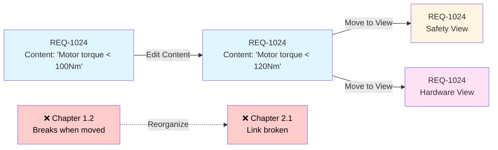
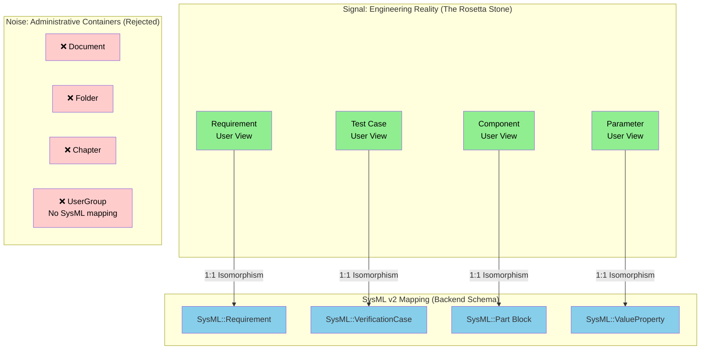
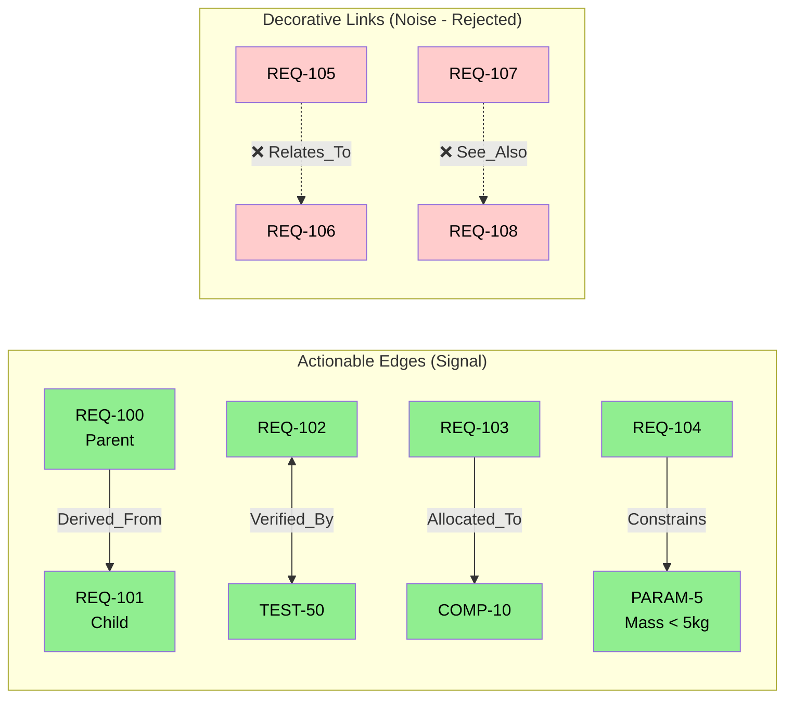
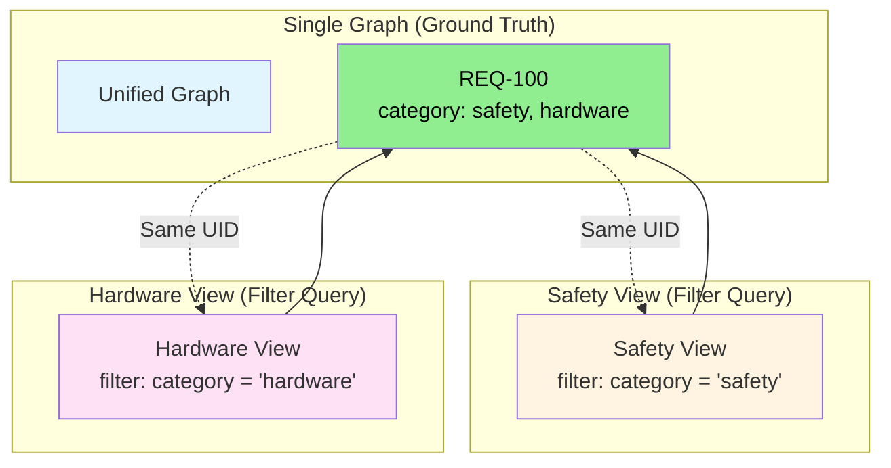
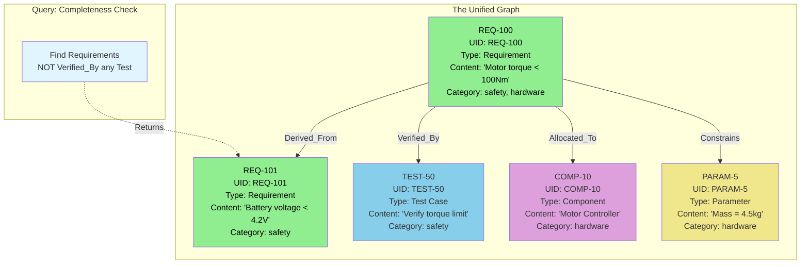
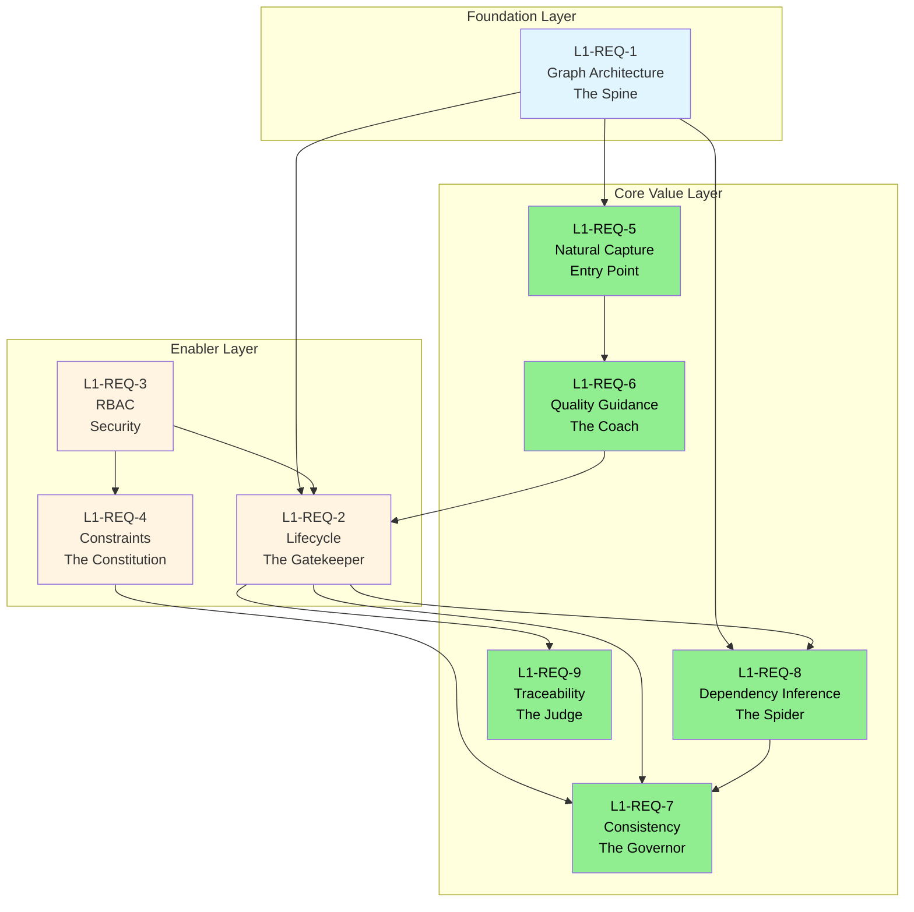

# System Overview & L1-REQ-1 (Connected Knowledge Graph) Architecture

**Purpose:** This document combines the high-level system overview with a deep-dive derivation of the foundational requirement (L1-REQ-1). It explains *what* we are building, *why* we are building it this way, and *how* the core graph architecture is derived from first principles.

---

## 1. The Big Picture: What We're Building

We are building a **Requirements Management Engine** that actively fights entropy rather than passively storing requirements. Unlike traditional tools that digitize the mess, this system enforces consistency, maintains relationships automatically, and prevents "zombie states" where outdated requirements remain active.

### The Core Problem We Solve

**"Zombie State" Problem:** In traditional requirements management:
- Requirements become stale when parents change, but children remain active
- Relationships are manually maintained (N² complexity problem)
- Bad requirements enter the database and are only caught weeks later
- Requirements are disconnected from implementation reality

**Our Solution:** An active system that:
- Blocks invalid requirements before they enter the database
- Automatically maintains relationships (solves N² complexity)
- Connects requirements to implementation reality (prevents stale data)
- Prevents garbage from entering (quality gates at source)

---

## 2. L1 vs L2: The Hierarchy

### L1 Requirements: Strategic Intent (The "What" and "Why")

**L1 = The Goal**
- **What:** High-level capability the system must provide
- **Why:** The business/engineering problem it solves
- **Format:** Outcome-focused, qualitative, strategic

### L2 Requirements: System Architecture (The "How")

**L2 = The Machine**
- **What:** Specific mechanisms, data structures, and logic rules required
- **Why:** Without these mechanisms, the L1 cannot physically exist
- **Format:** Binary-verifiable, specific, implementable

**The Relationship:**

```
L1 (Strategic Intent)
    ↓ Necessity Interrogation
    ↓ "What must be true for L1 to exist?"
    ↓
L2 (System Mechanisms)
    ↓ Implementation
    ↓
Working System
```

**Key Principle:** Every L2 must be **logically necessary** for its parent L1. If you remove an L2, the L1 fails.

---

## 3. The Derivation Method: Necessity Interrogation

To derive L2 requirements, we ask: **"What must be physically/logically true about the system for [L1] to exist?"**

This is not brainstorming—it's logical necessity. We derive L2s by identifying the rigid structures that must exist.

---

## 4. Deep Dive: The Foundation (L1-REQ-1)

This section demonstrates the derivation process for the system's most critical requirement: the Knowledge Graph.

### The L1 Requirement

**L1-REQ-1 – Connected Knowledge Graph Architecture**

**WHAT:**
The system shall store all engineering artifacts (requirements, signals, tests, components) as nodes in a **unified knowledge graph**, rather than in hierarchical folders. This graph must support **multi-dimensional views**, allowing the same underlying object to be accessed and manipulated via different contexts (e.g., Safety View, Hardware View) without duplication.

**WHY:**
Current "folder-based" tools strip away context. When a requirement is filed in a folder, it loses its connection to the rest of the system. By using a Semantic Graph, we capture not just the text, but the **intent of relationships** (e.g., _Why_ is this connected to that?). This ensures that when a User (or AI Agent) looks at a requirement, they see the complete web of dependencies, not just an isolated sentence.

### L2 Requirements Breakdown

#### L2-REQ-1.1: Immutable Identity (The Anchor)

**Derivation Question:** "For multi-dimensional views to work, what must be true about node identity?"

**Answer:** Each node must have a permanent, unchangeable identifier that survives all administrative changes. Without this, views cannot guarantee they reference the same underlying object.



**What It Means:**
- **UID Format:** `REQ-1024`, `TEST-50`, `COMP-10` (human-readable, permanent)
- **Survives:** Content edits, version history, view changes, hierarchy moves

#### L2-REQ-1.2: Physics-First Node Ontology (SysML v2 Isomorphic)

**Derivation Question:** "For the graph to represent engineering reality (not document structure), what node types must exist?"

**Answer:** The system must enforce a strict schema of node types that represent physical/logical entities, not administrative containers. Each type must map 1:1 to SysML v2 concepts to ensure future exportability.



**What It Means:**
- **Signal (MVP):** Requirement, Test Case, Component, Parameter maps 1:1 to SysML v2.
- **Noise (Cut):** Document, Folder, Chapter.

#### L2-REQ-1.3: Actionable Edge Types (The Verbs)

**Derivation Question:** "For relationships to have computable meaning, what edge types must exist?"

**Answer:** Edges must be actionable—they must enable the system to compute state changes, impact analysis, or validation outcomes. Generic "related to" links are banned.



**Signal (MVP):** `Derived_From` (Impact), `Verified_By` (Completeness), `Allocated_To` (Responsibility), `Constrains` (Validation).

#### L2-REQ-1.4: Graph Logical Model

**Derivation Question:** "For multi-dimensional views and relationship queries to work, what logical structure must data have?"

**Answer:** Data must be represented as a graph logical model (nodes + edges), regardless of physical storage (SQL/NoSQL). This forbids folder-based file structures.

#### L2-REQ-1.5: View Projection Mechanism

**Derivation Question:** "For multi-dimensional views to work without duplication, how must views be implemented?"

**Answer:** Views must be filter functions over the same underlying graph, not separate graph instances.



#### L2-REQ-1.6: Graph Traversability (The Query)

**Derivation Question:** "For users/agents to see the 'complete web of dependencies,' what query capabilities must exist?"

**Answer:** The system must support recursive graph traversal queries that answer "State of the World" engineering questions (e.g., "Find all Requirements NOT Verified_By any Test").

#### L2-REQ-1.7: Graph-to-Text Serialization (Polyglot)

**Derivation Question:** "For LLM agents to understand graph context without querying the entire database, what serialization mechanism must exist?"

**Answer:** The system must provide a deterministic mechanism to serialize nodes and their N-hop neighborhood into structured text.
- **Markdown (Fast/Human):** For speed and simple queries.
- **SysML v2 (Logic/Deep):** For complex reasoning and constraint checking.

### Complete Example: A Working Graph



---

## 5. The Engine: Other L1 Requirements (Summary)

Beyond the graph foundation (L1-REQ-1), the system implements these core engines:

| Component | L1 Requirement | L2 Mechanisms |
|-----------|----------------|---------------|
| **The Gatekeeper** | **L1-REQ-2 (Lifecycle)** | **State Machine:** Enforces Draft → Approved workflow. Blocks "zombie" (Draft) requirements from validation. Marks children "Stale" when parents change. |
| **The Security Layer** | **L1-REQ-3 (RBAC)** | **Permission Engine:** Enforces role-based access at the backend. Immutable permissions for Engineer vs Reviewer. |
| **The Constitution** | **L1-REQ-4 (Constraints)** | **Constraint Objects:** Stores Safety/Physical limits as evaluable formulas. Enables the system to know *what* is allowed. |
| **The Entry Point** | **L1-REQ-5 (Natural Capture)** | **Parser:** Automatic structuring of unstructured text. Keeps the graph in sync with how people actually write (bullets, docs). |
| **The Coach** | **L1-REQ-6 (Quality)** | **Ambiguity Detection:** Real-time "Socratic" filter. Flags vague terms ("fast", "robust") before approval. |
| **The Governor** | **L1-REQ-7 (Consistency)** | **Validation Engine:** **Active Blocking.** Evaluates constraints and blocks changes that violate them. Moves from passive notification to active quarantine. |
| **The Spider** | **L1-REQ-8 (Inference)** | **Inference Engine:** Solves N² complexity by automatically creating relationships via semantic matching. |
| **The Judge** | **L1-REQ-9 (Traceability)** | **Traceability Indexer:** Validates requirements against "Ground Truth" implementation (Git/CAD). Bridges the Semantic Gap. |

---

## 6. System Architecture: How L1s Work Together



---

## 7. First Principles Thinking

### Signal vs. Noise

- **Signal (What We Include):** Mechanisms the Engine can compute/enforce. Binary-verifiable requirements. Actionable relationships.
- **Noise (What We Exclude):** UI/visual elements ("intuitive", "clean"). Sliding scales. Decorative relationships.

### Binary Verifiability

Every L2 requirement must be **testable without human judgment**.
- ✅ **Good:** "System blocks approval if 'fast' is present." (Scriptable)
- ❌ **Bad:** "System is easy to use." (Opinion)

---

## 8. Summary

This system architecture is designed to **actively fight entropy**.
- **L1-REQ-1** provides the **Knowledge Graph** structure (the "Brain").
- **L1-REQ-2..9** provide the **Active Mechanisms** (the "Governor", "Spider", "Coach") that maintain the health of that graph.
- **Necessity Interrogation** ensures we only build what is logically required, avoiding "feature bloat" and focusing on the core problem: preventing zombie requirements.
