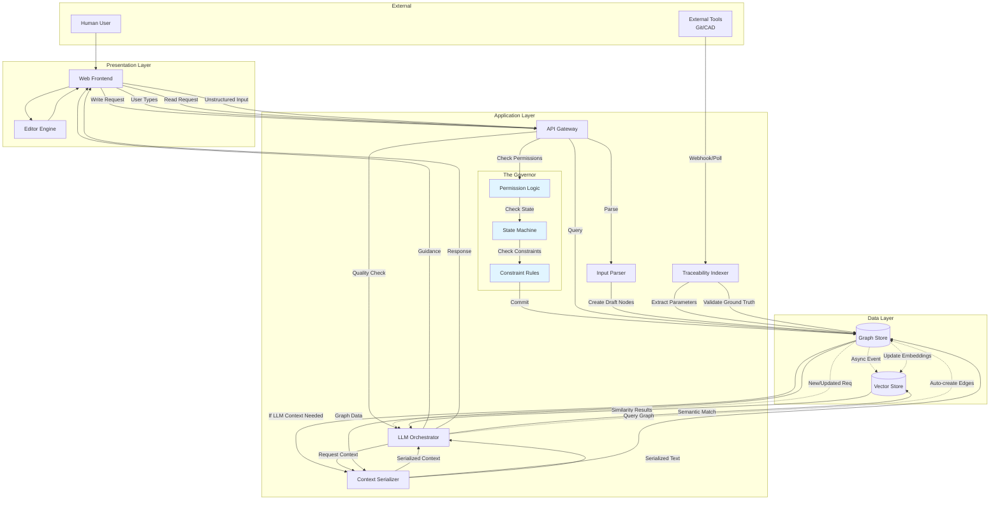

# System Architecture
**Version:** 1.0  
**Philosophy:** Signal over Noise, First Principles  
**Objective:** Logical architecture derived from L1/L2 requirements following the "Form follows Function" principle.

---

## System Boundary

**External Actors:**
- **Human User:** Provides unstructured input (L1-REQ-5), views requirements, approves requirements
- **External Tools:** Git repositories, CAD tools, ECAD tools (L1-REQ-9) - sources of implementation reality

**System Scope:**
The system is a Requirements Management Engine that actively fights entropy by:
- Enforcing consistency (blocks violations)
- Maintaining relationships automatically (solves N² complexity)
- Connecting requirements to implementation reality (prevents stale data)
- Preventing garbage from entering (quality gates at source)

---

## Architectural Layers

The system is organized into three logical layers:

1. **Presentation Layer:** User interaction and display
2. **Application Layer:** Business logic, validation, and orchestration
3. **Data Layer:** Persistent storage and retrieval

---

## Component Catalog

### Presentation Layer

#### Web Frontend
**L2 Traceability:** L1-REQ-5 (Natural Capture), L1-REQ-11 (Contextual Awareness), L1-REQ-12 (Discovery)

**Responsibilities:**
- Renders the knowledge graph visualization
- Captures unstructured input from users (L1-REQ-5)
- Displays contextual information (L1-REQ-11)
- Provides search and navigation interface (L1-REQ-12)
- Shows real-time guidance feedback (L1-REQ-6)

**Key Mechanisms:**
- Receives user input (text, bullets, pasted documents)
- Displays requirement nodes and relationships
- Shows quality guidance (ambiguity flags, verifiability suggestions)
- Renders multi-dimensional views (L2-REQ-1.5)

#### Editor Engine
**L2 Traceability:** L1-REQ-5 (Natural Capture), L1-REQ-11 (Contextual Awareness)

**Responsibilities:**
- Handles "Notion-like" interaction state
- Manages draft content before persistence
- Provides real-time editing experience
- Coordinates with LLM Orchestrator for quality guidance

**Key Mechanisms:**
- Maintains local editing state
- Triggers real-time quality checks as user types
- Synchronizes with backend on save

---

### Application Layer

#### API Gateway
**L2 Traceability:** L1-REQ-3 (RBAC), L1-REQ-7 (Active Consistency)

**Responsibilities:**
- Single entry point for all API requests
- Routes requests to appropriate components
- Enforces authentication
- Provides request/response transformation

**Key Mechanisms:**
- Receives HTTP requests from Frontend
- Validates authentication tokens
- Routes to The Governor for write operations
- Routes to Graph Store for read operations
- Routes to LLM Orchestrator for guidance requests

#### The Governor (Policy Engine)
**L2 Traceability:** L1-REQ-2 (Lifecycle), L1-REQ-3 (RBAC), L1-REQ-4 (Constraints), L1-REQ-7 (Active Consistency)

**Responsibilities:**
Single authority for "Can I do this?" - intercepts all write operations and enforces:
- Permission checks (RBAC)
- State machine transitions (Draft/Approved)
- Constraint evaluation and conflict blocking
- Stale detection and marking

**Internal Modules (NOT separate components):**

**Permission Logic:**
- L2-REQ-3.1: Role Definitions (Engineer, Reviewer, Admin)
- L2-REQ-3.2: Permission Enforcement Engine (backend-level blocking)
- L2-REQ-3.3: Role-Based Query Filtering (automatic filter application)

**State Machine:**
- L2-REQ-2.1: Requirement State Machine (Draft → Approved, one-way)
- L2-REQ-2.2: CRUD Operations (with state enforcement)
- L2-REQ-2.3: Stale Detection Mechanism (marks dependents when parent changes)
- L2-REQ-2.4: Approval Gate Enforcement (blocks Draft usage in validation)

**Constraint Rules:**
- L2-REQ-4.1: Constraint Object Schema (Safety, Physical, Logical constraints)
- L2-REQ-4.2: Constraint Definition Interface (Admin-only API)
- L2-REQ-4.3: Constraint-Requirement Relationship (Constrains edges, Defines_Context edges for scenario linking)
- L2-REQ-7.1: Constraint Evaluation Engine (real-time evaluation in scenario context via Defines_Context edge traversal)
- L2-REQ-7.2: Conflict Blocking Mechanism (backend-level blocking)
- L2-REQ-7.3: Dependency Conflict Detection (parent-child conflicts)
- L2-REQ-7.4: Real-Time Validation (synchronous validation before persistence)

**Key Mechanisms:**
- Intercepts all write operations (create, update, delete)
- Executes permission check → state check → constraint check (in sequence)
- Queries Graph Store for constraint relationships and scenario context (traverses Defines_Context edges from Constraint to Scenario nodes)
- Evaluates constraints in scenario context by traversing Defines_Context edges from Constraint to Scenario nodes
- Blocks violating operations with specific error messages
- Marks dependent requirements as Stale when parents change

#### Context Serializer
**L2 Traceability:** L1-REQ-1 (Graph Architecture), L1-REQ-6 (Quality Guidance), L1-REQ-8 (Inference)

**Responsibilities:**
- Converts graph neighborhoods to structured text formats
- Supports Markdown (human-readable) and SysML v2 (logic-oriented) formats
- Enables LLM agents to understand graph context

**L2 Requirements:**
- L2-REQ-1.7: Graph-to-Text Serialization (Markdown and SysML v2 formats, N-hop depth control, deterministic output)

**Key Mechanisms:**
- Receives node UID and depth parameter
- Traverses graph to collect N-hop neighborhood
- Serializes to Markdown (for RAG) or SysML v2 (for reasoning)
- Returns deterministic text output (enables caching)

#### LLM Orchestrator
**L2 Traceability:** L1-REQ-6 (Quality Guidance), L1-REQ-8 (Dependency Inference)

**Responsibilities:**
Manages LLM interactions for two modes:

**Coach Mode (Real-Time Guidance):**
- L2-REQ-6.1: Quality Analysis Engine (LLM-based unified quality check)
  - Single LLM prompt evaluates both ambiguity and verifiability
  - Returns structured JSON with `is_ambiguous`, `is_verifiable`, `suggestions`
  - Context-aware: understands "fast Fourier transform" is not ambiguous
- L2-REQ-6.2: ~~Verifiability Check~~ (DEPRECATED - merged into L2-REQ-6.1)
- L2-REQ-6.3: Real-Time Guidance Interface (on-demand quality checks)
- L2-REQ-6.4: Quality Gate Blocking (blocks approval if quality issues exist)

**Spider Mode (Background Inference):**
- L2-REQ-8.1: Semantic Matching Engine (vector embeddings, cosine similarity > 0.7)
- L2-REQ-8.2: Relationship Type Inference (LLM-based edge type determination)
  - LLM determines relationship type: Derived_From, Verified_By, Constrains, etc.
  - Automatic edge creation when confidence > 0.7
- L2-REQ-8.3: Relationship Confidence Scoring (0.0-1.0 confidence scores) [P1]
- L2-REQ-8.4: Background Inference Process (event-driven, async)

**Key Mechanisms:**
- Single LLM call for quality analysis (replaces dictionary + regex)
- LLM-based relationship inference (replaces pattern matching)
- Assembles prompts with graph context (via Context Serializer)
- Performs semantic matching using vector embeddings
- Creates graph edges automatically when confidence > threshold
- Runs as background process (async, non-blocking)

#### Input Parser
**L2 Traceability:** L1-REQ-5 (Natural Capture)

**Responsibilities:**
- Parses unstructured input (text, bullets, pasted documents)
- Extracts requirement statements and parameters
- Creates draft requirement nodes automatically
- Extracts implicit relationships from structure

**L2 Requirements:**
- L2-REQ-5.1: Unstructured Input Parser (pattern-based extraction)
- L2-REQ-5.2: Draft Requirement Creation (automatic creation in Draft state)
- L2-REQ-5.3: Content Synchronization (tracks source, syncs on changes)
- L2-REQ-5.4: Relationship Extraction (hierarchical and reference patterns)

**Key Mechanisms:**
- Receives unstructured text from Frontend
- Matches requirement patterns (regex: "The system shall...", numbered lists)
- Extracts parameters (regex: "Parameter Operator Value Unit")
- Creates Requirement nodes in Draft state
- Creates Derived_From edges from numbered list hierarchy
- Tracks source document for synchronization

#### Traceability Indexer
**L2 Traceability:** L1-REQ-9 (Live Implementation Traceability)

**Responsibilities:**
- Connects requirements to external implementation artifacts
- Extracts parameters from Git, CAD, ECAD tools
- Validates requirements against "ground truth" implementation data

**L2 Requirements:**
- L2-REQ-9.1: Ground Truth Verification (Physics Bridging - extracts parameters from datasheets, code, simulation results)

**Key Mechanisms:**
- Polls or receives webhooks from external tools (Git, CAD)
- Extracts measurable parameters using regex patterns
- Creates "Reality" nodes in graph (indexed, not copied)
- Compares requirement parameters against extracted values
- Flags conflicts when requirement ≠ implementation

---

### Data Layer

#### Graph Store
**L2 Traceability:** L1-REQ-1 (Graph Architecture)

**Responsibilities:**
- Stores all nodes and edges as first-class entities
- Executes recursive graph traversal queries
- Enforces graph schema (node types, edge types)
- Supports view projections (filter functions)

**L2 Requirements:**
- L2-REQ-1.1: Immutable Node Identity (UID format: REQ-1024, permanent anchors)
- L2-REQ-1.2: Typed Node Schema (7 types: Requirement, TestCase, Component, Parameter, Constraint, Job, Scenario)
- L2-REQ-1.3: Typed Directed Edges (6 types: Derived_From, Verified_By, Allocated_To, Constrains, Justifies, Defines_Context)
- L2-REQ-1.4: Graph Storage Model (logical model, implementation-agnostic)
- L2-REQ-1.5: View Projection Mechanism (filter functions, not graph copies)
- L2-REQ-1.6: Graph Query API (recursive traversals, completeness checks, impact analysis)

**Note:** Scenarios are first-class nodes in the graph (not metadata). Constraints are linked to Scenarios via Defines_Context edges (Scenario → Constraint) to enable context-aware validation (L2-REQ-4.3, L2-REQ-7.1).

**Performance Requirements:** Blast radius calculation (50+ nodes) completes within 5 seconds for 1000+ node graphs; Standard queries complete within 1 second (validated by SCN-STR-01)

**Key Mechanisms:**
- Stores nodes with UID, type, content, state, metadata (including scenario_variables for Scenario nodes)
- Stores edges with type, source UID, target UID, context (including scenario_uid for edge context)
- Stores Scenario nodes as first-class graph objects (enables scenario-aware validation via Defines_Context edges)
- Executes recursive CTEs (PostgreSQL) or graph traversals
- Supports queries: "find all nodes reachable via Derived_From", "find Requirements NOT Verified_By any Test", "find all Scenarios defining context for Constraint X"
- Returns same node UUID from all views containing it

#### Vector Store
**L2 Traceability:** L1-REQ-8 (Dependency Inference), L1-REQ-12 (Discovery)

**Responsibilities:**
- Stores embeddings for semantic search
- Enables similarity matching for relationship inference
- Supports concept-based navigation

**L2 Requirements:**
- L2-REQ-8.1: Semantic Matching Engine (uses embeddings for cosine similarity)

**Key Mechanisms:**
- Stores vector embeddings for requirement content
- Updates embeddings when requirements change (async, after Graph Store commit)
- Provides similarity search API for LLM Orchestrator
- Enables concept-based queries (L1-REQ-12)

---

## Component Interactions

### Interaction Diagram



---

## Component Dependencies

### Dependency Matrix

| Component | Depends On | Dependency Type | Purpose |
|-----------|-----------|------------------|---------|
| **API Gateway** | The Governor | Service Call | Routes write operations for validation |
| **API Gateway** | Graph Store | Data Access | Routes read operations |
| **API Gateway** | LLM Orchestrator | Service Call | Routes guidance requests |
| **The Governor** | Graph Store | Data Access | Queries constraints, requirements, relationships |
| **The Governor** | Vector Store | Data Access (indirect) | Not directly - via Graph Store |
| **Context Serializer** | Graph Store | Data Access | Traverses graph to collect neighborhoods |
| **LLM Orchestrator** | Context Serializer | Service Call | Gets graph context for prompts |
| **LLM Orchestrator** | Graph Store | Data Access | Reads requirements, creates edges |
| **LLM Orchestrator** | Vector Store | Data Access | Performs similarity search |
| **Input Parser** | Graph Store | Data Access | Creates draft requirement nodes |
| **Traceability Indexer** | Graph Store | Data Access | Creates/updates "Reality" nodes |
| **Graph Store** | Vector Store | Async Event | Triggers embedding updates on commit |
| **Vector Store** | Graph Store | Data Access | Reads requirement content for embeddings |

### Critical Path Dependencies

**All Write Operations:**
- Must pass through The Governor (Permission → State → Constraint checks)
- Cannot bypass The Governor (backend enforcement)

**All Read Operations:**
- Can query Graph Store directly (with role-based filtering applied by The Governor if needed)
- Context Serializer only used when LLM needs graph context

**Background Processes:**
- LLM Orchestrator (Inference) runs independently, triggered by Graph Store events
- Vector Store updates are async, triggered after Graph Store commits

---

## Critical Paths

### 1. Write Path (The "Governor's Gate")

**Flow:**
```
Frontend → API Gateway → The Governor (Permission Logic → State Machine → Constraint Rules) → Graph Store (Commit) → Vector Store (Async Index)
```

**Description:**
All write operations (create, update, delete) must pass through The Governor, which enforces:
1. **Permission Check:** Verifies user role has permission for operation (L2-REQ-3.2)
2. **State Check:** Validates state transitions (Draft → Approved) and blocks invalid operations (L2-REQ-2.1, L2-REQ-2.4)
3. **Constraint Check:** Evaluates constraints and dependency conflicts, blocks violations. When constraints are linked to scenarios (via Defines_Context edges), evaluates in scenario context to detect scenario-specific conflicts (L2-REQ-7.1, L2-REQ-7.2, L2-REQ-7.3, L2-REQ-7.4)

If all checks pass, The Governor commits to Graph Store. Graph Store commit triggers async event to update Vector Store embeddings.

**Key Requirements:**
- L2-REQ-7.4: Real-time validation (synchronous, before persistence)
- L2-REQ-2.3: Stale detection (marks dependents when parent changes)
- L2-REQ-7.2: Backend-level blocking (cannot bypass via API)

### 2. Drafting Path (The "Coach" - L1-REQ-6)

**Flow:**
```
Frontend (User types) → API Gateway → LLM Orchestrator (Quality Check - Ambiguity Detection, Verifiability) → Frontend (Red squiggly lines)
```

**Description:**
Real-time guidance loop that happens **before** the Governor commits to DB. As user types/edits requirement content:
1. Frontend sends content to LLM Orchestrator
2. LLM Orchestrator checks for ambiguous terms (L2-REQ-6.1) and verifiability (L2-REQ-6.2)
3. Guidance results returned to Frontend immediately
4. Frontend displays flags/suggestions to user

This is a **separate loop** from the write path - guidance is computed during editing, not after save.

**Key Requirements:**
- L2-REQ-6.3: Real-time guidance computation (as user types, before persistence)
- L2-REQ-6.4: Quality gate blocking (blocks approval if quality issues unresolved)

### 3. Read/View Path (The "Projector")

**Flow:**
```
Frontend → API Gateway → Graph Store (Recursive Query) → Context Serializer (If LLM needs it) → Frontend
```

**Description:**
Read operations query Graph Store directly (with role-based filtering applied). If LLM Orchestrator needs graph context (e.g., for relationship inference), it requests Context Serializer to serialize N-hop neighborhood.

**Key Requirements:**
- L2-REQ-1.6: Graph Query API (recursive traversals)
- L2-REQ-3.3: Role-Based Query Filtering (automatic filter application)
- L2-REQ-1.7: Graph-to-Text Serialization (for LLM context)

### 4. Implementation Sync (The "Spider" - L1-REQ-9)

**Flow:**
```
External Tools (Git/CAD) → Traceability Indexer → Graph Store (Update "Reality" Nodes)
```

**Description:**
Traceability Indexer polls or receives webhooks from external tools, extracts parameters, and updates "Reality" nodes in Graph Store. These nodes represent implementation artifacts (code, CAD models) indexed (not copied) for validation.

**Key Requirements:**
- L2-REQ-9.1: Ground Truth Verification (extracts parameters, validates against requirements)

### 5. Background Inference (The "Spider" - L1-REQ-8)

**Flow:**
```
Graph Store (New/Updated Req) → LLM Orchestrator (Semantic Matching) → Graph Store (Auto-create edges) → Vector Store (Update embeddings)
```

**Description:**
Background process that runs continuously (event-driven, not scheduled):
1. Graph Store triggers event when requirement created/updated
2. LLM Orchestrator performs semantic matching (L2-REQ-8.1) using Vector Store
3. If match confidence > threshold (0.7), automatically creates edge (L2-REQ-8.2)
4. Updates Vector Store embeddings for new/updated requirements

**Key Requirements:**
- L2-REQ-8.4: Background Inference Process (continuous, event-driven)
- L2-REQ-8.1: Semantic Matching Engine (TF-IDF, cosine similarity)
- L2-REQ-8.2: Automatic Edge Creation (creates edges without user confirmation)

---

## Component Interface Specifications

### The Governor

**Write Operation Interface:**
```
write_operation(operation_type, node_uid, content, user_role) → Result
  - Checks Permission Logic (L2-REQ-3.2)
  - Checks State Machine (L2-REQ-2.1, L2-REQ-2.4)
  - Checks Constraint Rules (L2-REQ-7.1, L2-REQ-7.3)
  - Returns: Success or Error with specific violation message
```

**Query Interface:**
```
query_requirements(filter_params, user_role) → List[Requirement]
  - Applies Role-Based Query Filtering (L2-REQ-3.3)
  - Returns filtered results
```

### Graph Store

**Query Interface:**
```
query_graph(query_type, start_node_uid, edge_type, depth) → List[Node]
  - Supports recursive traversals (L2-REQ-1.6)
  - Returns nodes reachable via specified edge types
```

**Write Interface:**
```
create_node(node_type, content, properties) → Node
update_node(node_uid, content, properties) → Node
create_edge(edge_type, source_uid, target_uid) → Edge
```

### LLM Orchestrator

**Coach Mode Interface:**
```
check_quality(requirement_content) → GuidanceResult
  - Returns: ambiguous_terms_list, verifiability_status, suggestions
```

**Spider Mode Interface:**
```
infer_relationships(requirement_uid) → List[Edge]
  - Performs semantic matching
  - Creates edges automatically if confidence > threshold
  - Runs as background process
```

### Context Serializer

**Serialization Interface:**
```
serialize(node_uid, format, depth) → String
  - format: 'markdown' or 'sysml'
  - depth: N-hop neighborhood (0 = node only, 1 = immediate neighbors, etc.)
  - Returns deterministic text output
```

---

## Architecture Principles

### 1. Necessity Filter
Every component must trace to specific L2 requirements. If a component cannot point to L2 requirements that created it, it should not exist.

### 2. Cohesion Principle
Related logic (Permissions, State, Constraints) lives inside The Governor as internal modules, not as separate components. If components change together, they should be in the same logical component.

### 3. Signal over Noise
- **Signal:** Functional components required by L2 requirements
- **Noise:** Infrastructure details (Kubernetes, Docker, Redis) - not in logical architecture

### 4. First Principles
Form follows Function - components exist because requirements demand them, not because "we need microservices."

### 5. Single Authority
The Governor is the single authority for "Can I do this?" - all write operations must pass through it.

---

## Architectural Decisions & Traps Avoided

This section documents key architectural decisions and engineering traps that were avoided during design. These decisions explain the "Why" behind component choices and scope boundaries.

### 1. The "Editor Engine" Risk
**Trap:** Building a "Notion-like" block editor from scratch.
**Decision:** Use Streamlit Chat Interface - no editor needed.
**Rationale:** 6 months to get undo/redo right. Chat interface is sufficient for L1-REQ-5 (Natural Capture). Streamlit provides chat components out of the box.

### 2. The "Rule Engine" Risk
**Trap:** Building a Drools-style rule engine for The Governor.
**Decision:** Hard-coded if/else statements in Python code.
**Rationale:** Rule engines are bloat. Hard constraints are simple code. The Governor is just validation logic, not a configurable system.

### 3. The "Integration Platform" Risk
**Trap:** Building full Git/CAD/ECAD integrations upfront.
**Decision:** Remove traceability entirely from MVP. Move to V1 when there's actual implementation to validate against.
**Rationale:** For greenfield projects, there's no existing code/CAD to trace to. Traceability becomes valuable when there's implementation to validate against.

### 4. The "Agent Framework" Risk
**Trap:** Building complex agent workflows with multi-step reasoning.
**Decision:** One-shot LLM prompts only.
**Rationale:** Agents require massive testing. Simple prompts provide 80% value.

### 5. The "Scale Optimization" Risk
**Trap:** Building sharding/partitioning before having users.
**Decision:** Single Postgres instance.
**Rationale:** Postgres handles 10M rows easily. Don't optimize prematurely.

### 6. The "Traceability Indexer" Risk
**Trap:** Building traceability to external sources when there are no external sources.
**Decision:** Remove Traceability Indexer from MVP entirely.
**Rationale:** For greenfield projects (development from scratch), there's no existing Git repos, CAD files, or legacy data to trace to. L1-REQ-9 (Live Implementation Traceability) is P1 (V1) - it will be valuable once there's actual implementation to validate against.

---

## L3 Generation Guidance

When generating L3 requirements, use this architecture to specify:
- **Component Allocation:** Which component is responsible for each mechanism
- **Interface Specifications:** What APIs/data structures each component exposes
- **Interaction Patterns:** How components communicate (service calls, data access, async events)

**Example:**
- **Without Architecture:** "The system shall check if the parent requirement exists."
- **With Architecture:** "The **Governor** (State Machine module) shall query the **Graph Store** to validate the parent ID exists before accepting the Write operation."

---

## Version History

- **v1.0:** Initial architecture derived from L1/L2 requirements following First Principles approach

